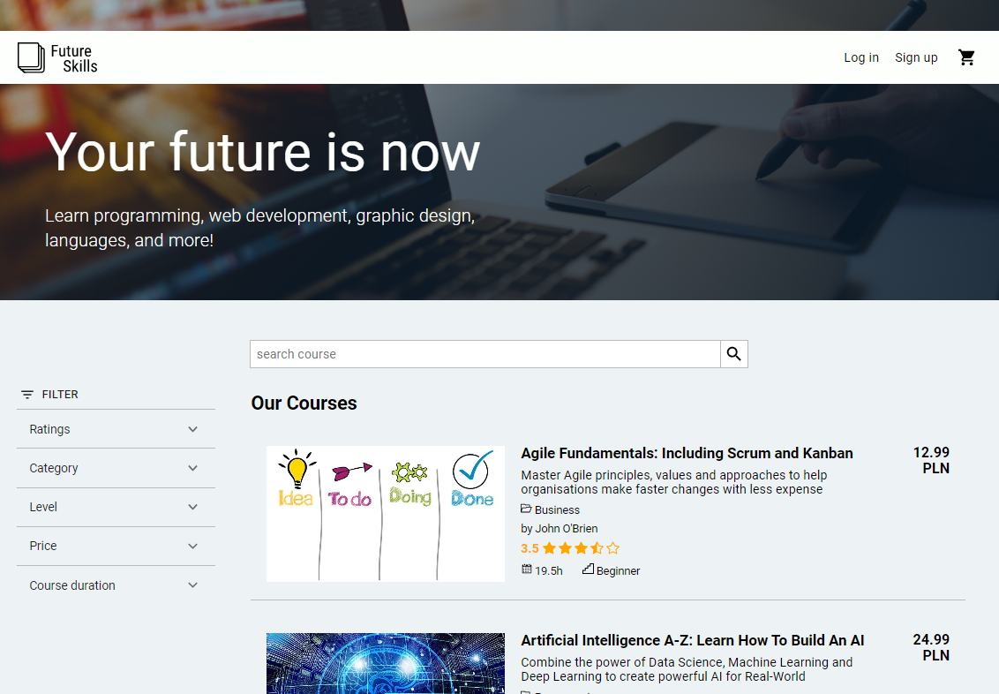

# E-Commerce App - FUTURE SKILLS

## Table of Content
* [Intro](#intro)
* [Tech Stack](#tech-stack)
* [Features](#features)
* [Setup](#setup)
* [Live Demo](#live-demo)

## Intro

This is a group project built by three trainee developers 👩‍🎓 💻 during the Junior Front-end Developer Course at InfoShare Academy. The main objective of the project was to create an e-commerce app. We created an app named Future Skills that offers a selection of on-line courses.



## Tech Stack

⭐ ReactJS

⭐ Redux

⭐ JavaScript

⭐ Firebase (Firestore, Authentication)

⭐ Material-UI

## Features

⭐ Display of all the available courses on the home page

⭐ Filtering courses by category, price, rating, level and course duration

⭐ Adding items to the shopping cart

⭐ Editing the content of the shopping cart

⭐ Viewing the purchase history for logged in users

⭐ Setting up a new user 

⭐ Logging out functionality


## Setup

Clone this repo and run ```$ npm install ``` to install all dependencies.

Once all the dependecies are installed, you can run ```$ npm start ``` to start the application.

It runs the app in the development mode.\
Open [http://localhost:3000](http://localhost:3000) to view it in the browser.

The page will reload if you make edits.\
You will also see any lint errors in the console.

## Live demo

You can also click [Future Skills](https://infoshareacademy.github.io/jfdzr2-front-family/#/) to see live demo.
